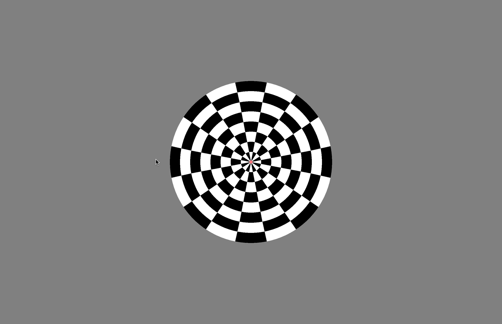
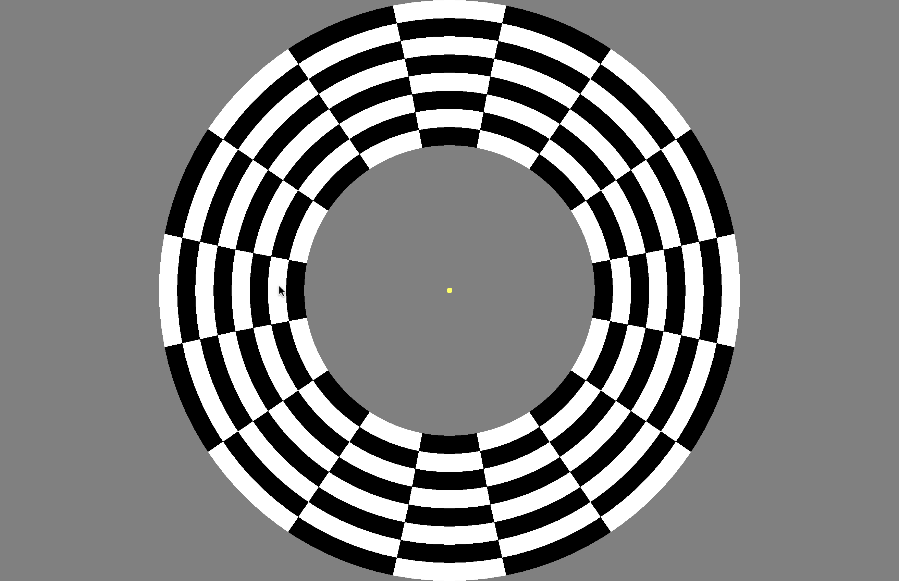
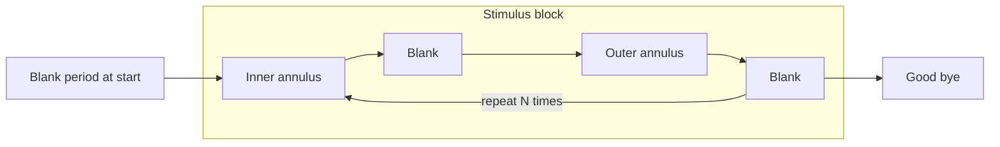
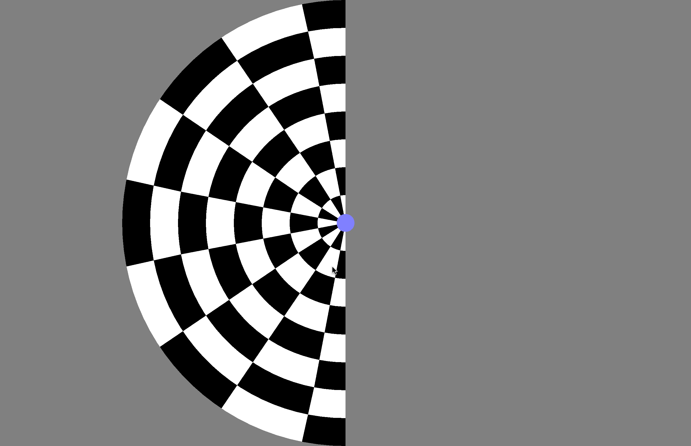
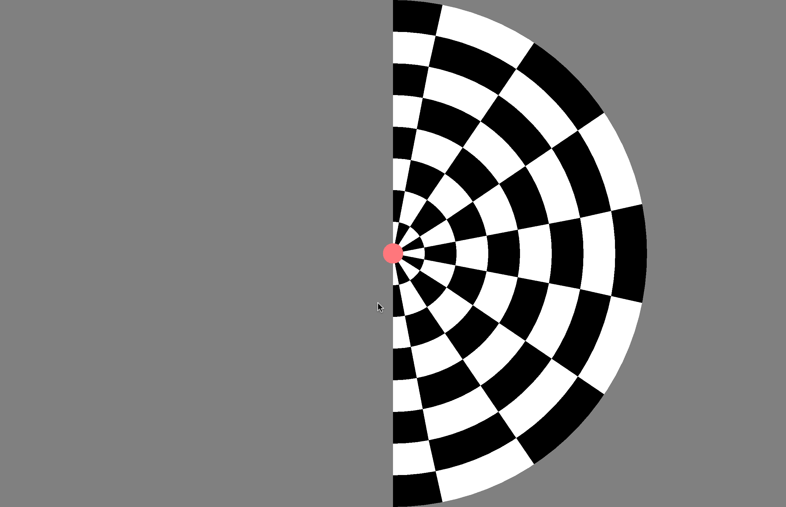

## Basic Vision stimuli for 7T

2025-05-05, Denis Schluppeck

Stimuli for fMRI experiments written in [PsychoPy](https://www.psychopy.org/download.html)

Stimuli can either be run via command line (my preferred) if PsychoPy module is installed or via the PsychoPy GUI (to be tested more completely).

## Stimulus programs

### `eccLoc.py` - Eccentricity localiser

Alternates two annuli (inner and outer) with a blank period for e.g. 







```text
usage: ./eccLoc.py [-h] [-on ONLENGTH] [-off OFFLENGTH] [-nb NUMBLOCKS] [-np NULLPERIOD] [-ss STIMSIZE] [-fp FLASHPERIOD] [-g] [-v]

Visual stimulus that alternates a ring of given eccentricity A with an off block, the eccentricity B with off block. The eccentricity
(full height) corresponds to 1.0 (default), and A and B annuli together cover the full extent of that range

optional arguments:
  -h, --help            show this help message and exit
  -on ONLENGTH, --onLength ONLENGTH
                        How long is the block on? (seconds)
  -off OFFLENGTH, --offLength OFFLENGTH
                        How long is the block off? (seconds)
  -nb NUMBLOCKS, --numBlocks NUMBLOCKS
                        How many blocks?
  -np NULLPERIOD, --nullPeriod NULLPERIOD
                        Duration of gray screen at start (seconds)
  -ss STIMSIZE, --stimSize STIMSIZE
                        Stimulus size (fraction of screen height)
  -fp FLASHPERIOD, --flashPeriod FLASHPERIOD
                        Flash period (seconds)
  -g                    Use the GUI to set params
  -v                    Set verbose output

./eccLoc.py --onLength 12 --offLength 0 --numBlocks 1 --nullPeriod 0
```

- @TODO: add more details on the timing of the blocks and the blank periods

### `hemiLoc.py` - Left vs Right hemifield localiser

Alternates two annuli (left and right) with a blank period for e.g.




```bash
./hemiLoc.py --onLength 12 --offLength 0 --numBlocks 1 --nullPeriod 0
```

```text
usage: ../hemiLoc.py [-h] [-bl BLOCKLENGTH] [-nb NUMBLOCKS]
                     [-np NULLPERIOD] [-ss STIMSIZE]
                     [-fp FLASHPERIOD] [-g] [-v]

Visual stimulus that alternates a hemifield stimulus between left
and right

optional arguments:
  -h, --help            show this help message and exit
  -bl BLOCKLENGTH, --blockLength BLOCKLENGTH
                        How long is the block on? (seconds)
  -nb NUMBLOCKS, --numBlocks NUMBLOCKS
                        How many blocks?
  -np NULLPERIOD, --nullPeriod NULLPERIOD
                        Duration of gray screen at start (seconds)
  -ss STIMSIZE, --stimSize STIMSIZE
                        Stimulus size (fraction of screen height)
  -fp FLASHPERIOD, --flashPeriod FLASHPERIOD
                        Flash period (seconds)
  -g                    Use the GUI to set params
  -v                    Set verbose output

./hemiLoc.py -bl 12 -nb 10 -np 0 -ss 1.0 -fp 0.25
```

## Use at UoN

These block design and event-related stimuli are designed for use in the 7T scanner at the University of Nottingham. The current iteration emphasises 
- basic visual stimuli for localising retinotopic areas, LGN, etc.
- simple visual task to maintain attention
- fexibility to adjust block and event lengths to fit with `TR` / dynamic scan times of the fMRI experiments


## Acknowledgements

This repo is a fork of Alex Beckett's https://github.com/AdvancedMRI/python_stimuli code with some modifications to run on later version of PsychoPy and different handling of command line args. 🙏
