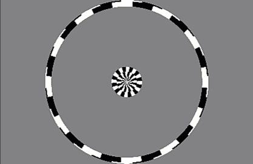
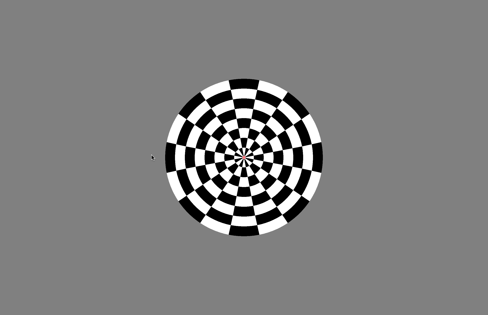
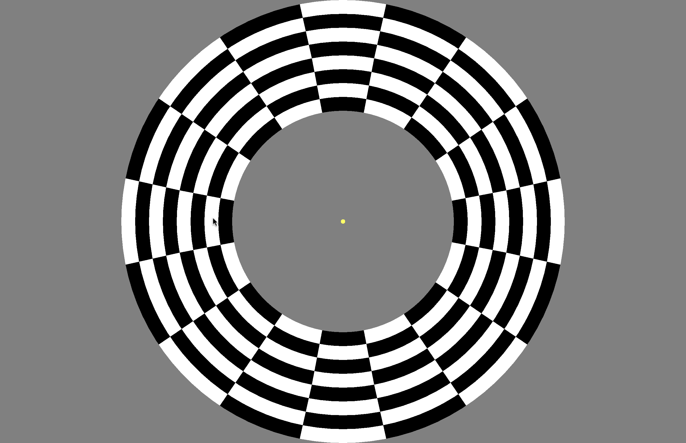
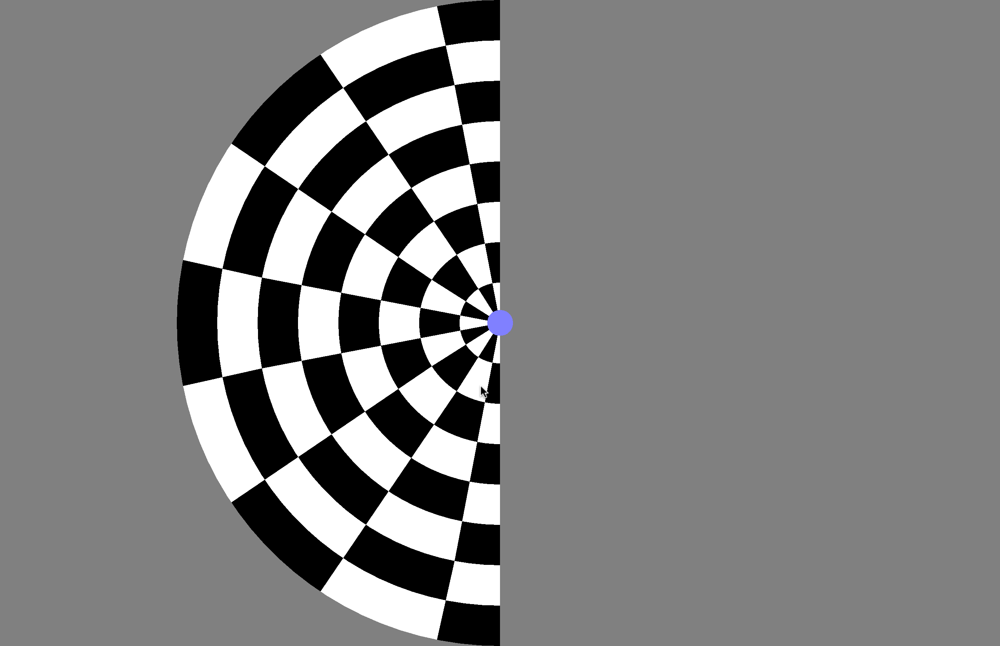
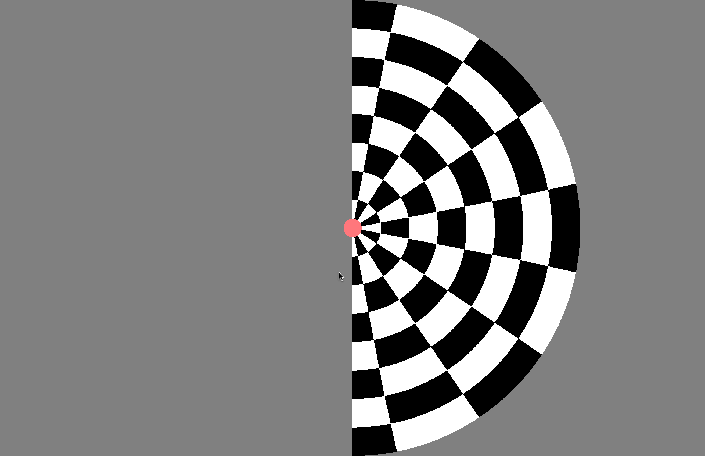
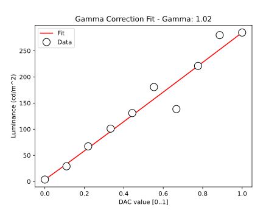

Stimuli for fMRI experiments written in [PsychoPy](https://www.psychopy.org/download.html)

Stimuli can either be run via command line (if you are running under `linux` this will be easier) or via the PsychoPy GUI (easier if you are running under `Windows`).

## Stimulus programs

There are some stimulus programs that will allow you to do standard visual neuroscience stuff, retinotopy, etc. And if you want to make your own stimulus programs, there are some instructions on how to add hooks into `psychopy` builder (via code-snippets) to trigger from scanner, get button responses, etc.

### `retinotopy.py` 

Sliding checkerboard annuli / wedges / bars

Rings (expanding, contracting), wedges (clockwise, counterclockwise), and bars of checkerboard segments that move against each other. Many parameters can be changed. See documentation for details. 



For example:

```bash
# bars that cross the screen in 12s, 5 cycles
# -e -tr 2 - allows for exporting stim image mat files 
./retinotopy.py -dir bar_f -ct 12 -np 5 -e -tr 2.0
```

- [usage](./retinotopy_py.html)


### `eccLoc.py` - Eccentricity localiser

Alternates two annuli (inner and outer) with a blank period for e.g. 





```{mermaid}
flowchart LR;
  a[Blank period<br><tt>nullPeriod</tt>] --> b1;
  subgraph Stimulus[Stimulus, <tt>* numBlocks</tt> ]
    b1[Inner annulus<br><tt>onLength</tt>] --> br1[Blank<br><tt>offLength</tt>]; 
    br1 --> b2[Outer annulus<br><tt>onLength</tt>];
    b2 -->  br2[Blank<br><tt>offLength</tt>];
  end;
  br2 --> c1[Good bye];
  style Stimulus fill:#ddd,stroke:#333,stroke-width:2px
```

```text
usage: ./eccLoc.py [-h] [--vpixx] [--no-vpixx] [--coding-window]
                   [--screen-size SCREEN_SIZE SCREEN_SIZE] [--check-timing] [--use-gui]
                   [-on ONLENGTH] [-off OFFLENGTH] [-nb NUMBLOCKS] [-np NULLPERIOD]
                   [-ss STIMSIZE] [-fp FLASHPERIOD] [-g] [-v]

Visual stimulus that alternates a ring of given eccentricity A with an off block, the
eccentricity B with off block. The eccentricity (full height) corresponds to 1.0
(default), and A and B annuli together cover the full extent of that range

optional arguments:
  -h, --help            show this help message and exit
  --vpixx               use VPIXX device
  --no-vpixx            run without VPIXX device (eg for testing)
  --coding-window       use small debug window for coding
  --screen-size SCREEN_SIZE SCREEN_SIZE
                        screen size as width height
  --check-timing        check screen timing (false on MacOS: buggy timing!)
  --use-gui             use GUI to set parameters (overrides command line args)
  -on ONLENGTH, --onLength ONLENGTH
                        How long is the block on? (seconds)
  -off OFFLENGTH, --offLength OFFLENGTH
                        How long is the block off? (seconds)
  -nb NUMBLOCKS, --numBlocks NUMBLOCKS
                        How many blocks?
  -np NULLPERIOD, --nullPeriod NULLPERIOD
                        Duration of gray screen at start (seconds)
  -ss STIMSIZE, --stimSize STIMSIZE
                        Stimulus size (fraction of screen height)
  -fp FLASHPERIOD, --flashPeriod FLASHPERIOD
                        Flash period (seconds)
  -g                    Use the GUI to set params
  -v                    Set verbose output

./eccLoc.py --onLength 12 --offLength 0 --numBlocks 1 --nullPeriod 0
```


### `hemiLoc.py` - Left vs Right hemifield localiser

**work in progress**

Alternates two annuli (left and right) with a blank period for e.g.




```bash
./hemiLoc.py --onLength 12 --offLength 0 --numBlocks 1 --nullPeriod 0
```

```text
usage: ../hemiLoc.py [-h] [-bl BLOCKLENGTH] [-nb NUMBLOCKS]
                     [-np NULLPERIOD] [-ss STIMSIZE]
                     [-fp FLASHPERIOD] [-g] [-v]

Visual stimulus that alternates a hemifield stimulus between left
and right

optional arguments:
  -h, --help            show this help message and exit
  -bl BLOCKLENGTH, --blockLength BLOCKLENGTH
                        How long is the block on? (seconds)
  -nb NUMBLOCKS, --numBlocks NUMBLOCKS
                        How many blocks?
  -np NULLPERIOD, --nullPeriod NULLPERIOD
                        Duration of gray screen at start (seconds)
  -ss STIMSIZE, --stimSize STIMSIZE
                        Stimulus size (fraction of screen height)
  -fp FLASHPERIOD, --flashPeriod FLASHPERIOD
                        Flash period (seconds)
  -g                    Use the GUI to set params
  -v                    Set verbose output

./hemiLoc.py -bl 12 -nb 10 -np 0 -ss 1.0 -fp 0.25
```

## Use at UoN

These block design and event-related stimuli are designed for use in the 7T scanner at the University of Nottingham. The current iteration emphasises 

- basic visual stimuli for localising retinotopic areas, LGN, etc.
- simple visual task to maintain attention
- fexibility to adjust block and event lengths to fit with `TR` / dynamic scan times of the fMRI experiments

## Calibration, $\gamma$

**TL;DR.** The `VPixx` by default uses a $\gamma$ of 1.0, i.e. it's already linear and doesn't require additional correction in your code.

**Details.** For vision applications, where we want to control the properties of stimuli carefully, knowing the display properties of the display is crucial. In particular, it's important to have good control over luminance changes, e.g. we'd like to be sure that going from gray value 100 to 110 (out of 255) implies the same change as going from 200 to 210. The `VPixx` projector uses DLP technology and has approximately linear output ($\gamma \approxeq 1.0$).  This is great for vision/visual neuroscience applications, but may make "normal" images look a bit washed out, as most common displays have a gamma value of around 2.0



Average luminance (gray value 0.5 or 127/256): 144.28 cd/m^2 (You can also look at calibration data, which we will aim to re-collect: [calibration-csv](./2026-05-14T113213-calib.csv))

We used a Konica Minolta LS-150 ([details](https://www.konicaminolta.com/instruments/download/catalog/light/pdf/ls150_catalog_eng.pdf)) to measure at 10 levels - by hand.

## Notes

`mermaid / version`:

```{mermaid}
  info
```


## Acknowledgements

This repo started as a fork of Alex Beckett's <https://github.com/AdvancedMRI/python_stimuli> code. Modifications to run on later version of PsychoPy, some functionality to make work with `VPixx` hardware, triggering, etc, dnd different handling of command line args. 🙏
